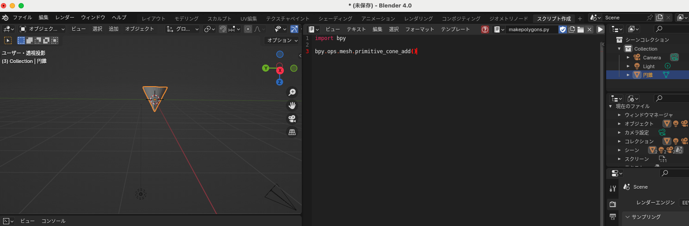

## Blender + Python
#### Blender の Script で Pythonコードを実行できる


- [Blender ダウンロードページ](https://www.blender.org/download/)
- [Blender で Python スクリプトを実行](https://www.kkaneko.jp/db/cg/bpy.html)
- [Blender API (bpy) リファレンス(英語)](https://docs.blender.org/api/current/index.html)
- Blender で Unity 向けにエクスポート (メッシュだけの方がよさそう？)
  - モデルを選択し、 ファイル > エクスポート > FBX
- Unity で Blender からインポート
  - Assets > Import New Assets > FBXを選択して Import
- [Blender Macでコンソール出力を表示させる](https://www.patec-tech.jp/process/?p=3762)

```python
# 円錐 https://docs.blender.org/api/current/bpy.ops.mesh.html#bpy.ops.mesh.primitive_cone_add
bpy.ops.mesh.primitive_cone_add()

# 立方体 https://docs.blender.org/api/current/bpy.ops.mesh.html#bpy.ops.mesh.primitive_cube_add
bpy.ops.mesh.primitive_cube_add()

# 円柱 https://docs.blender.org/api/current/bpy.ops.mesh.html#bpy.ops.mesh.primitive_cube_add
bpy.ops.mesh.primitive_cylinder_add()

# 球 https://docs.blender.org/api/current/bpy.ops.mesh.html#bpy.ops.mesh.primitive_uv_sphere_add
bpy.ops.mesh.primitive_uv_sphere_add()

# 直方体 https://docs.blender.org/api/current/bpy.ops.transform.html#bpy.ops.transform.resize
depth = 3 # 奥行
width = 4 # 幅
height = 5 # 高さ
bpy.ops.mesh.primitive_cube_add()
bpy.ops.transform.resize(value=(depth, width, height))
```


